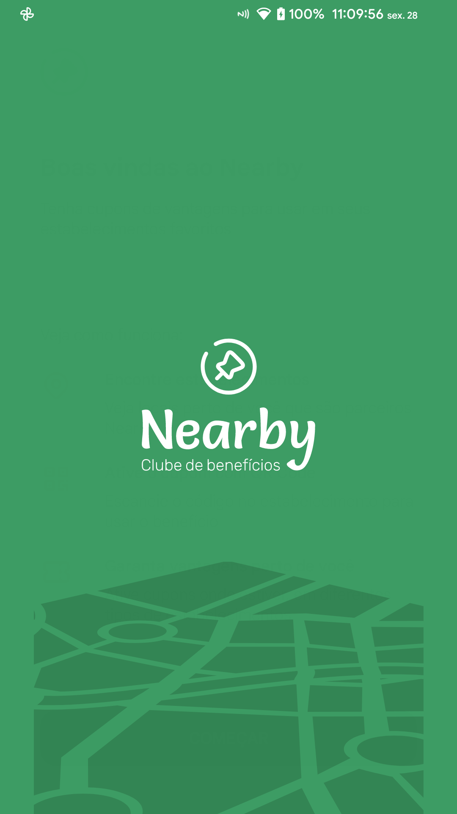
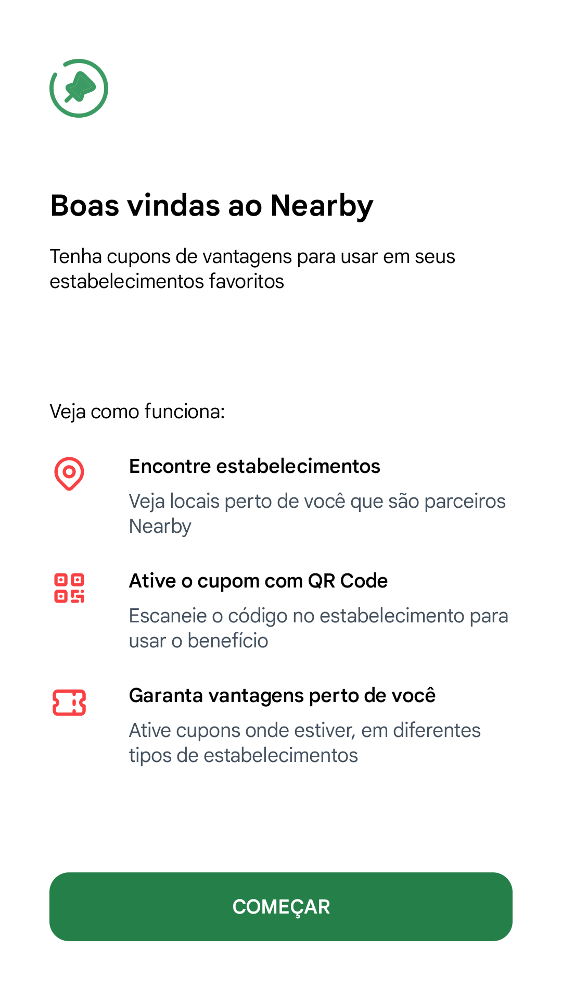
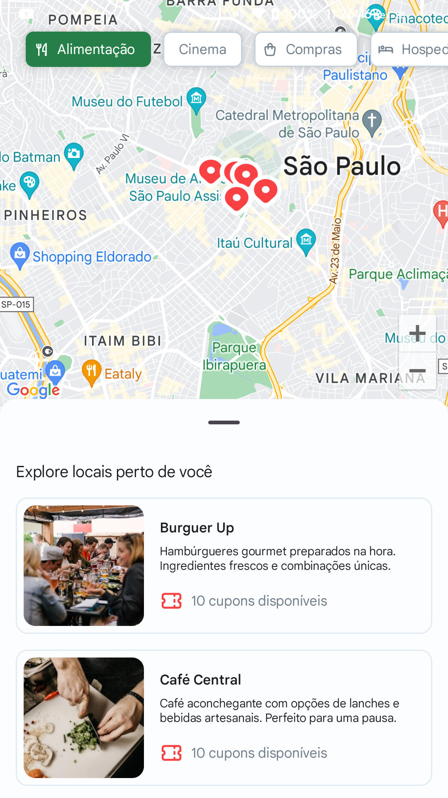
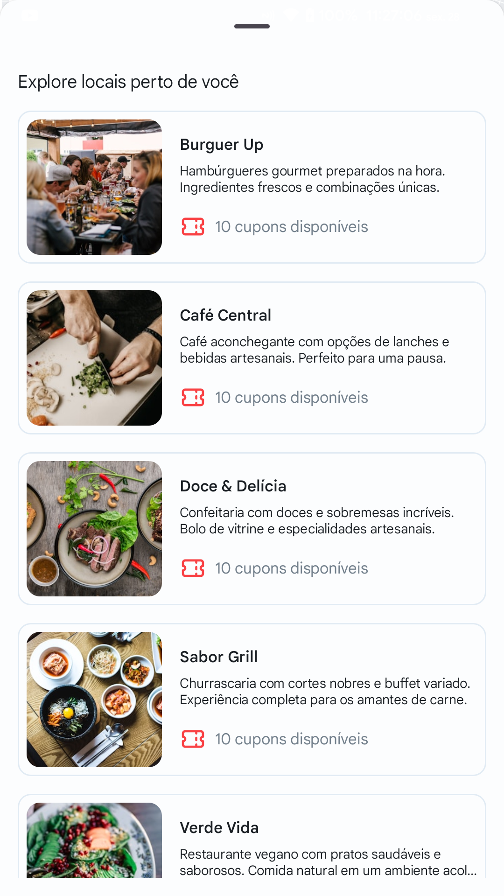
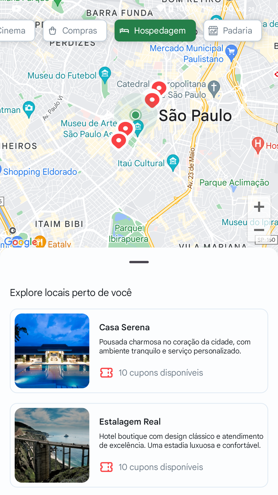
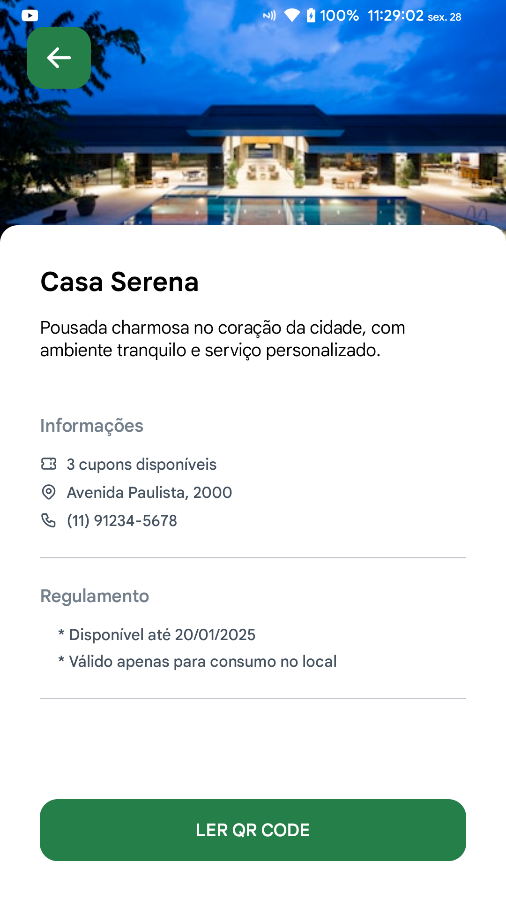

# Nearby
Aplicativo Android de benefícios em estabalecimentos com base na localização atual

### Objetivo
Visualizar estabelecimentos perto nas proximidades, acessar detalhes do estabelecimento e resgatar cupom (benefício) 

### Funcionalidades
- Visualizar estabalecimentos em mapa (Google Maps)
- Escolher categoria e filtrar estabalecimentos
- Visualizar detalhes de um estabelecimento
- Ler QR Code e resgatar cupom para o estabelecimento

### Linguagem / Tecnologia utilizada
Kotlin - Jetpack Compose

### Serviço externo
- Google Maps
- ZXing (QR Code Scanner)

### Screenshots
     
